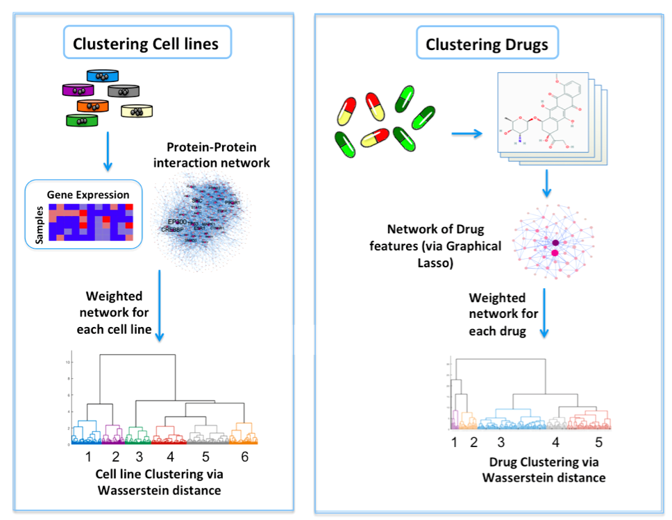
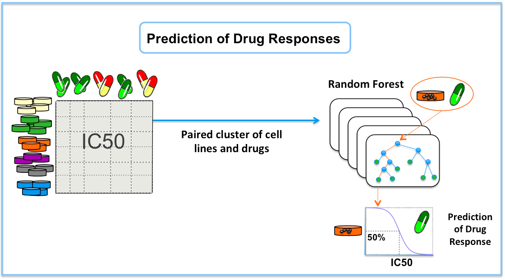

# Pan-cancer prediction of cell line-drug sensitivity using network-based methods

For clustering of cell lines, the gene expression profiles for 915 cell lines were analyzed on the HPRD network. Invariant measures for individual nodes were then computed, and the Wasserstein distance (EMD) was computed between each pair of cell lines on the network. Lastly, hierarchical clustering was performed on the resultant Wasserstein distance matrix. For clustering of drugs, we obtained the cheminformatic features of 200 drugs, and built a data-driven network of cheminformatic features using the graphical LASSO. Similar to cell lines, hierarchical clustering was performed on the resultant Wasserstein distance matrix. 

 

A random forest model was built on each paired cluster of cell lines and drugs to predict drug responses in log(IC50) values.    

## Code & Data
1. Clustering_cell_lines.m: Clustering cell lines  
  a. cell_line_data.mat: Information of cell lines  
  b. distance_matrix_cell_lines.mat: Wasserstein distance in gene networks  
2. Clustreing_drugs.m: Clustering drugs  
  a. drug_data.mat: Information of drugs  
  b. distance_matrix_drugs.mat: Wasserstein distance in drug feature networks

